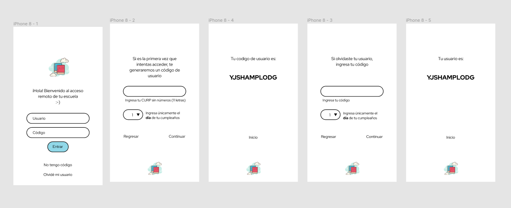
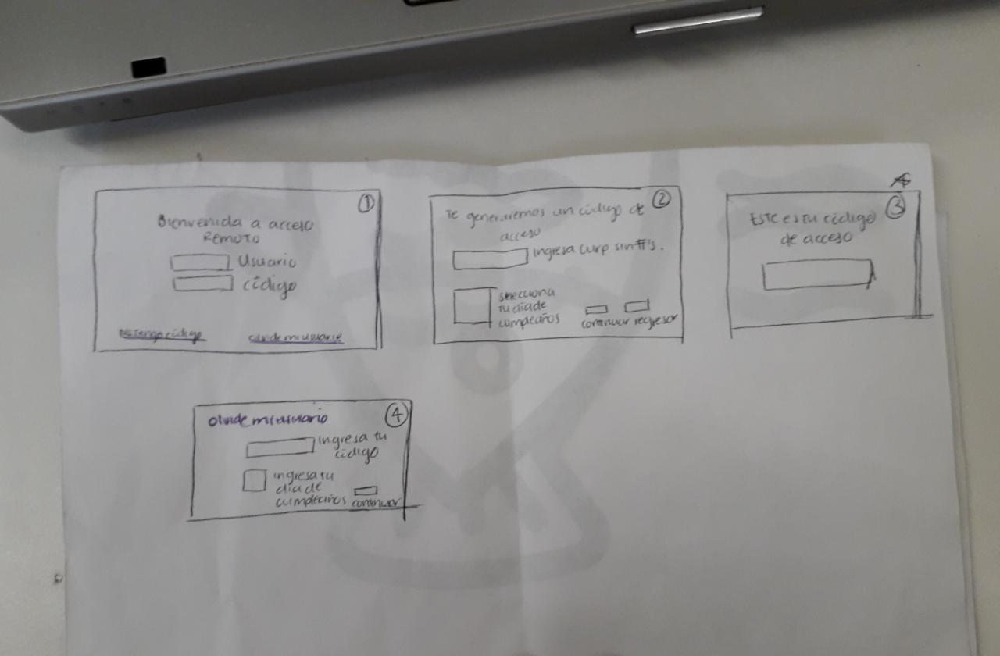
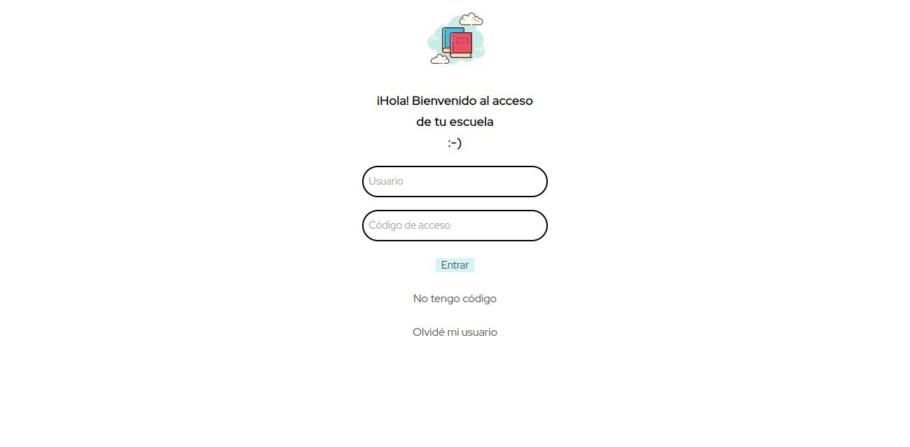
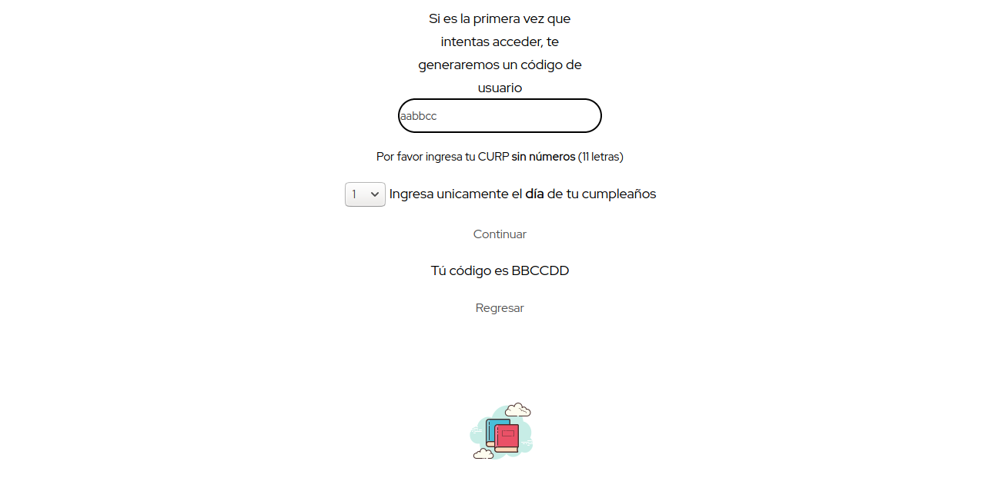
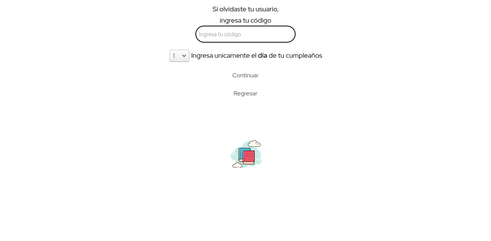

# Cifrado César 
## Aplicación de Acceso Remoto 

Mi app es para generar usuarios y códigos de acceso a la biblioteca digital de una escuela de manera remota. 

*Investigación UX*

1. Mis usuarios son estudiantes de preparatoria y universidad y/o escuelas que cuentan con biblioteca digital a la que se tiene acceso usando unicamente la red escolar. Para tener acceso a la bilbioteca fuera de la escuela se creó esta app que genera un usuario por medio del curp de los estudiantes y un código de acceso que se crea a través del código ascii. 

2. La app ayuda a crear usuarios y códigos de acceso. El usuario se crea a partir del CURP de los alumnos usando únicamente las letras y el código de acceso es el CURP + los desplazamientos, el desplazamiento se elige utilizando el día de nacimiento del usuario, esta es la parte de cifrado. En el decifrado es en caso que el estudiante olvide su usuario, ingresa su código de acceso y nuevamente el desplazamiento se define usando el día de nacimiento. 

3. 

4. Con base en los feedbacks, limpié mi código al mejorar mi identación en cada uno de mis archivos, esto me ayudó a que tanto yo como los coaches pudieran entender mejor mi código. También comprendí mejor mi código, no es solo copy paste, sino el escribir en papel mi fórmula me ayudó a poder entender qué es lo que estaba haciendo y que tenía que modificar para conseguir la funcionalidad que buscaba. En cuanto al diseño, unicamente se me dijo que completara algunos "espacios vacíos" que tenía en mi framework para mejorar el flujo del diseño. 

Reflexiona y luego marca los objetivos que has llegado a **entender** y **aplicar** en tu proyecto.

### UX

- [x] Diseñar la aplicación pensando y entendiendo al usuario.
- [x] Crear prototipos para obtener feedback e iterar.
- [x] Aplicar los principios de diseño visual (contraste, alineación, jerarquía).

### HTML y CSS

- [x] Uso correcto de HTML semántico.
- [x] Uso de selectores de CSS.
- [ ] Construir tu aplicación respetando el diseño realizado (maquetación).

### DOM

- [x] Uso de selectores del DOM.
- [x] Manejo de eventos del DOM.
- [ ] Manipulación dinámica del DOM.

### Javascript

- [x] Manipulación de strings.
- [x] Uso de condicionales (if-else | switch).
- [ ] Uso de bucles (for | do-while).    
- [x] Uso de funciones (parámetros | argumentos | valor de retorno).
- [x] Declaración correcta de variables (const & let).

### Testing
- [ ] Testeo de tus funciones.

### Git y GitHub
- [x] Comandos de git (add | commit | pull | status | push).
- [x] Manejo de repositorios de GitHub (clone | fork | gh-pages).

### Buenas prácticas de desarrollo
- [x] Uso de identificadores descriptivos (Nomenclatura | Semántica).
- [ ] Uso de linter para seguir buenas prácticas (ESLINT).

